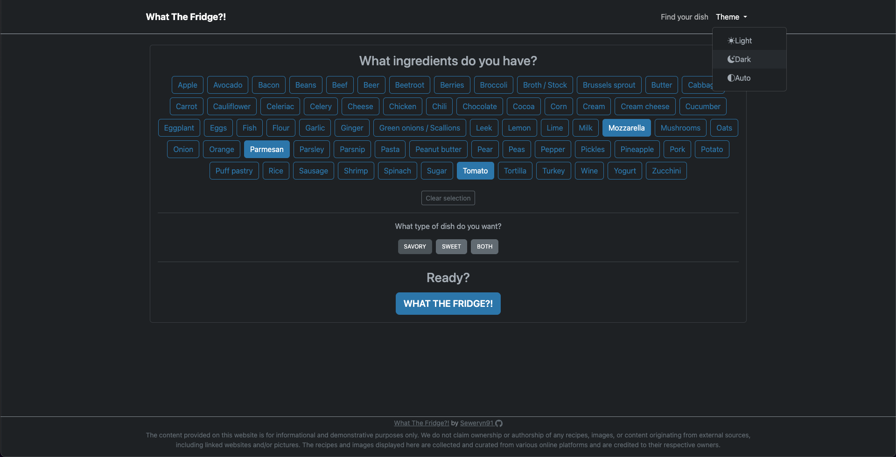

**This project is _work in progress_, please be patient and wait for further updates.**

# WhatTheFridge?!

Have you ever had a look in your fridge wondering "What can I do with this?".

Not feeling like digging through cookbooks or scrolling hundreds of culinary blogs?
Watching culinary videos makes you hungry?

**What The Fridge?!** is the perfect solution for you!

**What The Fridge?!** is the perfect solution for every individual (even a cellar dweller)[^1] that has some spare time to cook, but cannot decide what to eat.

How it works?
1. Download, compile and run, then go to localhost:8080 . Or ask an IT guy to do it for you.
2. Go to Main Page and click "Check it out"

3. Choose ingredients you have handy, you can decide if you want your dish to be sweet or savory _(or just skip it, nobody will judge)._

4. Click **What The Fridge?!**
5. Start exploring!

6. **What The Fridge?!** offers a variety of recipe suggestions, sorted by the number of ingredients you currently have available!
7. If you are feeling like an admin go to localhost:8080/login and provide credentials:
   1. Username: admin
   2. Password: admin

8. Now you can manage dishes and ingredients: view, edit, remove and create new recipes. You can also change the way list of recipes is sorted: by name or ID, ascending or descending, due to implementation of Paging and Sorting Repository!

Thanks to using Bootstrap this page is fully responsive, so you can use it on your mobile device!

[^1]: Comes with Dark Mode!

  
### TL;DR:

Simple application that makes your culinary decisions easier.
Click on ingredients you have, choose if you want something sweet or savory and Bob's your uncle.

Download, compile, and go to localhost:8080

If you want to mess with stuff go to localhost:8080/login and type login: admin , pass: admin .

Tech stack:

Backend:

* Brains:
  - Java 18
  - Spring Boot
  - Spring Security 6
  - Thymeleaf 3.1
  
* Build:
  - Maven
  
* Server:
  - Tomcat 10
  
* DB:
   - H2
  
* ORM:
  - Hibernate 6.1
  
* Testing:
  - Junit 5.9.2
  - Mockito 5.3
  
Frontend:
  * Bootstrap 5.3 alpha
  * Some vanilla JS

Disclaimer:
The content provided on this website is for informational and demonstrative purposes only. We do not claim ownership or authorship of any recipes, images, or content originating from external sources, including linked websites and/or pictures. The recipes and images displayed here are collected and curated from various online platforms and are credited to their respective owners.
